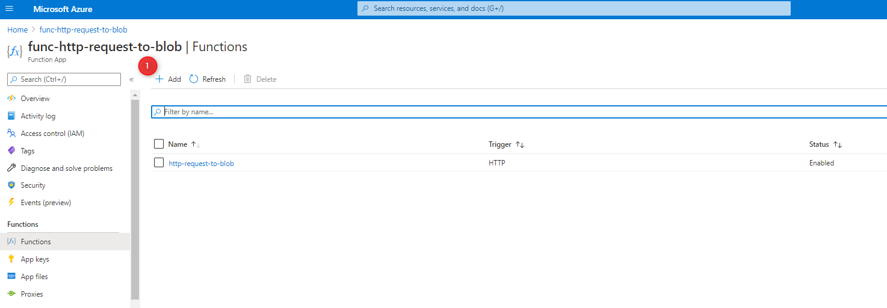
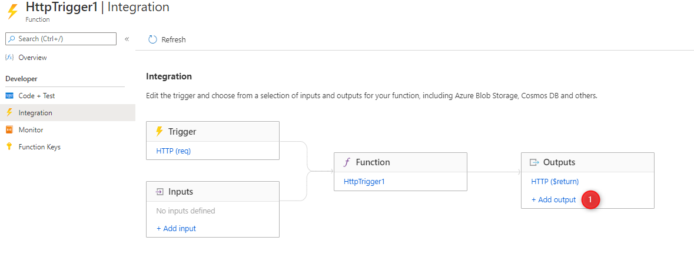
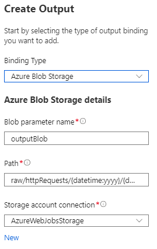
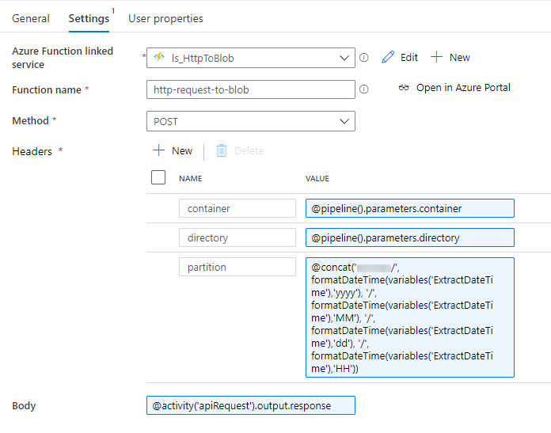

# func-http-request-to-blob

**Description**


This Azure Function App will take a HTTP request and write it to Blob storage.  This is useful in Data Factory when the API Service requires a session cookie for authentication.  Today, the cookie that is obtained in a login Web Activity cannot be added to the Copy Data activity.  Use this approach to write data from a web call to an Azure Blob.


**Instructions**


***Function App***


1. Create Azure Function App

1. Create new Azure Function

   
   

1. Edit Function, navigate to **Integration**

1. Add Output: 

   
   - Binding Type: *Azure Blob Storage*

   - Blob parameter name: *outputBlob*

   - Path: *raw/httpRequests/{datetime:yyyy}/{datetime:MM}/{datetime:dd}/{datetime:HH}/{DateTime}-{rand-guid}.json*

   - Storage account connection: *AzureWebJobsStorage*

     
     

     
     

1. Delete Output: Click on the default output **HTTP ($return)** and choose delete

   
   

1. Edit Code: click on Code + Test

   ```c#:HttpRequestToBlob/run.csx
   #r "Newtonsoft.Json"
   #r "Microsoft.Azure.WebJobs.Extensions.Storage"
   
   using System.Net;
   using Microsoft.AspNetCore.Mvc;
   using Microsoft.Extensions.Primitives;
   using Newtonsoft.Json;
   using Microsoft.Azure.WebJobs.Extensions.Storage;
   
   public static async Task<IActionResult> Run(
       HttpRequest req,
       ILogger log,
       TextWriter outputBlob,
       Binder binder
   )
   {
       try {
           log.LogInformation("C# HTTP trigger function processed a request.");
   
           //Set container and directory from the Request query
           string container = req.Query["container"];
           string directory = req.Query["directory"];
           string partition = req.Query["partition"];
   
           //Set container and directory from the Headers
           string containerHeader = req.Headers["container"];
           string directoryHeader = req.Headers["directory"];
           string partitionHeader = req.Headers["partition"];
   
           //Read the request body - this should contain what we want to write to Blob
           string requestBody = await new StreamReader(req.Body).ReadToEndAsync();
           dynamic body = JsonConvert.DeserializeObject(requestBody);
   
           //If query parameter values don't exist, then see if they are in the body, then in the header, and finally default.
           container = container ?? body?.container ?? containerHeader ?? "raw";
           directory = directory ?? body?.directory ?? directoryHeader ?? "httpRequests";
           partition = partition ?? body?.partition ?? partitionHeader ?? "httpRequest";
   
           //Define the Blob location
           var blobFileName = Guid.NewGuid();
           var blobName = $"{container}/{directory}/{partition}/{blobFileName}.json";
           var storageAttribute = "AzureWebJobsStorage"; //Be sure that the Function App has this defined.
   
           //Create the attributes of the Blob
           var attributes = new Attribute[]
           {
               new BlobAttribute($"{blobName}"),
               new StorageAccountAttribute(storageAttribute)
           };
   
           //Write to the Blob, using attributes as defined above
           using (var writer = await binder.BindAsync<TextWriter>(attributes))
           {
               writer.Write(requestBody);
           }
   
           //Create OK results to send back to the requester (Data Factory)
           string result = $"{{'result': 'ok', 'status': 200, 'blobName': '{blobName}'}}";
           dynamic data = JsonConvert.DeserializeObject(result);
   
           //Send results back to the requester (Data Factory)
           return new OkObjectResult(data);
       }
       catch (Exception ex)
       {
           log.LogInformation($"Caught exception: {ex.Message}");
   
           string result = $"{{'result': 'bad', 'status': 400, 'Error': '{ex.Message.Replace("'", "\"")}'}}";
           dynamic data = JsonConvert.DeserializeObject(result);
           return new BadRequestObjectResult(data);
       }
   }
   ```

***Data Factory***


1. Create Data Factory Pipeline that has the login call, as well as a web activity that will return your desired data

   
   

1. Link the web activity to an Azure Function activity

1. Setup Linked Service for your Azure Function.  Take Key from the Azure Function portal page

1. Setup Activity

   
   - Method: *Post*

   - Add Headers:

     
     - container - container in Azure Data Lake storage account that you want to land the data in

     - directory - the directory in the above container

     - partition - how you want the data partitioned.  I like to partition by date

       
       `@concat('subjectArea/', formatDateTime(variables('ExtractDateTime'),'yyyy'), '/', formatDateTime(variables('ExtractDateTime'),'MM'), '/', formatDateTime(variables('ExtractDateTime'),'dd'), '/', formatDateTime(variables('ExtractDateTime'),'HH'))`

   - Add Body - click on Dynamic Content and choose the previous activity and add *.response* to the end

     
     

